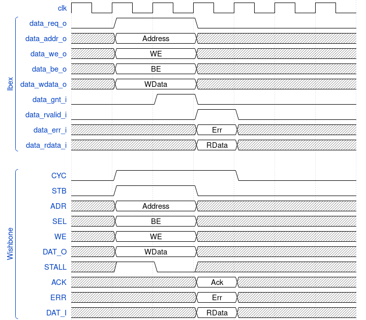

# ibex_wb
RISC-V Ibex core with Wishbone B4 interface.

## Design
The instruction and data memory interfaces are converted to
Wishbone.
[These examples](https://github.com/pbing/ibex_wb/tree/master/sim) use shared bus
interconnection between masters (instruction bus, data bus) and slaves (e.g. memory, LED driver).
For better throughput or latency a crossbar interconnect can be considered.

## Ibex memory control vs. Wishbone bus

### Basic Memory Transaction

### Back-to-back Memory Transaction

### Slow Response Memory Transaction

## Status
Simulated with Synopsys VCS.

## Recources
- [Wishbone at opencores.org](https://opencores.org/howto/wishbone)
- [ZipCPU](http://zipcpu.com/zipcpu/2017/11/07/wb-formal.html) for a deeper understanding of the pipelined mode.
