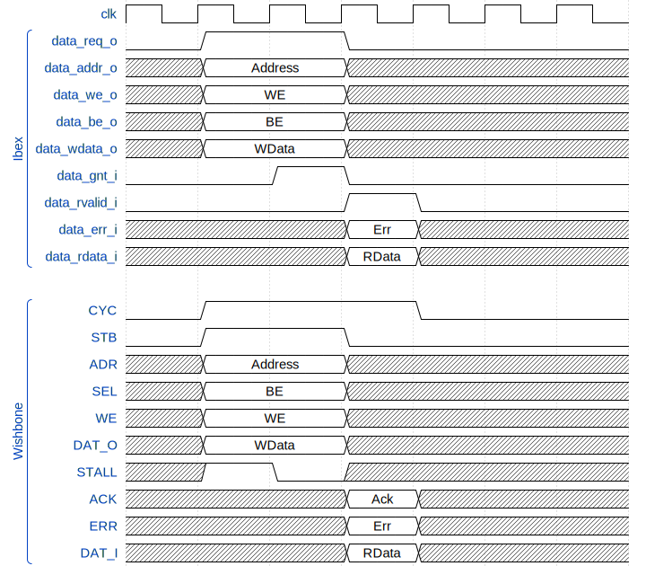
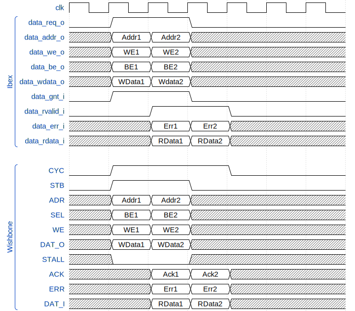
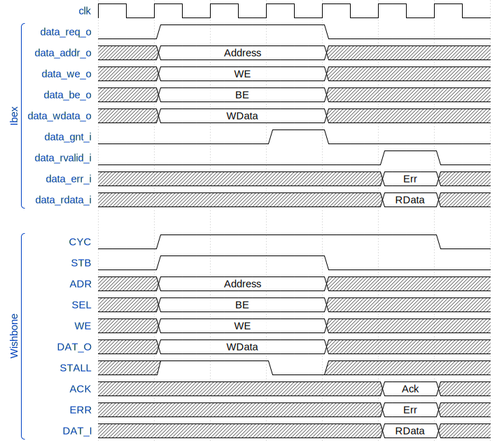

# ibex_wb
[RISC-V Ibex](https://ibex-core.readthedocs.io/en/latest/index.html) core with Wishbone B4 interface.

## Design
The instruction and data memory interfaces are converted to Wishbone.

## Status
- simulated with Verilator
- implemented in Vivado
- programmed on FPGA board
- use debugger via BSCANE2

To be done:
- use debugger via JTAG

## Linting with Verilator
```shell
cd soc/fpga/arty-a7-100/lint
./lint.sh
```

## Simulation with Verilator
```shell
cd soc/fpga/arty-a7-100/sim
./use.sh ../sw/nettle-aes/nettle-aes.vmem
./build.sh
./sim.sh
less trace_core_00000000.log
gtkwave dump.fst
```

## Openocd
### Via BSCANE2
Start `openocd`
```shell
arty-a7-100/util% openocd -f arty-a7-openocd-cfg.tcl
Open On-Chip Debugger 0.12.0
Licensed under GNU GPL v2
For bug reports, read
	http://openocd.org/doc/doxygen/bugs.html
force hard breakpoints
Info : ftdi: if you experience problems at higher adapter clocks, try the command "ftdi tdo_sample_edge falling"
Info : clock speed 10000 kHz
Info : JTAG tap: riscv.cpu tap/device found: 0x13631093 (mfg: 0x049 (Xilinx), part: 0x3631, ver: 0x1)
Info : datacount=2 progbufsize=8
Info : Examined RISC-V core; found 1 harts
Info :  hart 0: XLEN=32, misa=0x40101104
Info : starting gdb server for riscv.cpu on 3333
Info : Listening on port 3333 for gdb connections
Info : Listening on port 6666 for tcl connections
Info : Listening on port 4444 for telnet connections
```

## Debugging with GDB
```shell
sw/led% riscv32-unknown-elf-gdb -ex "target extended-remote localhost:3333" <executable-file>
GNU gdb (crosstool-NG 1.26.0_rc1) 13.2
Copyright (C) 2023 Free Software Foundation, Inc.
License GPLv3+: GNU GPL version 3 or later <http://gnu.org/licenses/gpl.html>
This is free software: you are free to change and redistribute it.
There is NO WARRANTY, to the extent permitted by law.
Type "show copying" and "show warranty" for details.
This GDB was configured as "--host=x86_64-build_pc-linux-gnu --target=riscv32-unknown-elf".
Type "show configuration" for configuration details.
For bug reporting instructions, please see:
<toolchains@lowrisc.org>.
Find the GDB manual and other documentation resources online at:
    <http://www.gnu.org/software/gdb/documentation/>.

For help, type "help".
Type "apropos word" to search for commands related to "word"...
Reading symbols from led.elf...
Remote debugging using localhost:3333
```

## Ibex memory control vs. Wishbone bus

### Basic Memory Transaction
<p align="center"></p>

### Back-to-back Memory Transaction
<p align="center"></p>

### Slow Response Memory Transaction
<p align="center"></p>

### Interconnect with Shared Bus
The shared bus interconnect has the lowest latency but long combinational paths.
This can lead to a decrease of the maximum clock frequency.

An instruction cache does not improve the performance by a large amount.

#### Timing without ICACHE
| Program    | Cycles | Instructions   | CPI  |
|------------|--------|----------------|------|
| crc_32     | 35032  | 23689          | 1.48 |
| nettle-aes | 93902  | 64380          | 1.46 |
| geom. mean |        |                | 1.47 |

#### Timing with ICACHE
| Program    | Cycles | Instructions   | CPI  |
|------------|--------|----------------|------|
| crc_32     | 35044  | 23689          | 1.48 |
| nettle-aes | 87829  | 64380          | 1.36 |
| geom. mean |        |                | 1.42 |

### Interconnect with Crossbar
The [crossbar](https://zipcpu.com/blog/2019/07/17/crossbar.html) interconnect uses skid buffers.
Therefor the latency has been increased.

The optional [instruction cache](https://ibex-core.readthedocs.io/en/latest/03_reference/icache.html)
is designed to improve CPU performance in systems with high instruction memory latency.
The instruction cache integrates into the
CPU by replacing the prefetch buffer, interfacing directly between the bus and IF stage.

#### Timing without ICACHE
| Program    | Cycles | Instructions   | CPI  |
|------------|--------|----------------|------|
| crc_32     | 71124  | 23689          | 3.00 |
| nettle-aes | 219912 | 64380          | 3.42 |
| geom. mean |        |                | 3.20 |

#### Timing with ICACHE
| Program    | Cycles | Instructions   | CPI  |
|------------|--------|----------------|------|
| crc_32     | 44478  | 23689          | 1.88 |
| nettle-aes | 134913 | 64380          | 2.10 |
| geom. mean |        |                | 1.98 |

## FPGA Implementation
[Arty A7-100T](https://digilent.com/shop/arty-a7-100t-artix-7-fpga-development-board/)

Two variants were implemented. The clock for the SOC was 50 MHz.

| WB Interconnect | Icache | LUT  | Registers |
|-----------------|--------|------|-----------|
| Shared          | no     | 3938 | 1987      |
| Crossbar        | yes    | 5115 | 2848      |

## Recources
- [Wishbone at opencores.org](https://opencores.org/howto/wishbone)
- [ZipCPU](http://zipcpu.com/zipcpu/2017/11/07/wb-formal.html) for a deeper understanding of the pipelined mode.
- [WB2AXIP: Bus interconnects, bridges, and other components](https://github.com/ZipCPU/wb2axip/)
